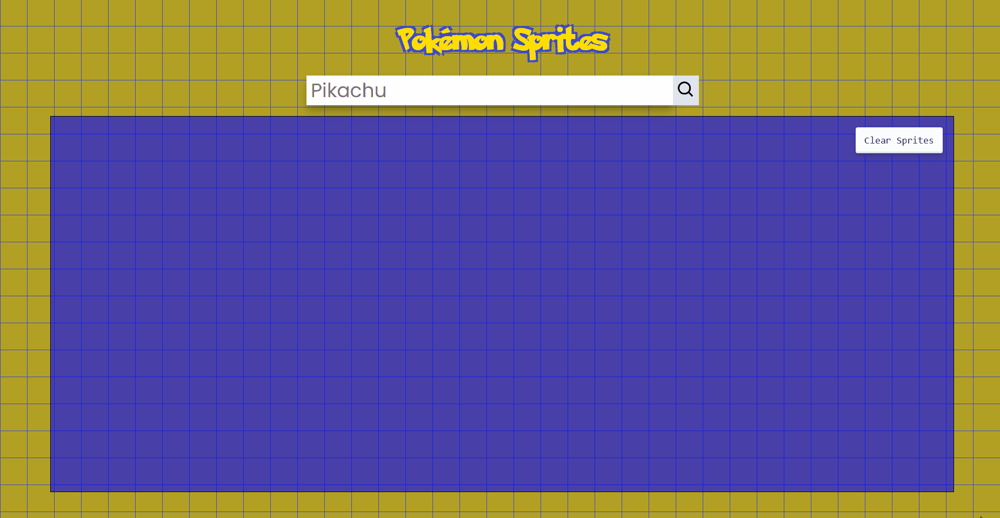

# pokemon-sprites-search


Hello, I'm excited to introduce you to one of my projects!

The project uses Vue 2 with Vue CLI to create a Pokémon sprite viewer by connecting to 'https://pokeapi.co/'. The idea is to quickly retrieve Pokémon sprites to assist in the potential development of a game or similar projects.

## Project setup
```
npm install
```

### Compiles and hot-reloads for development
```
npm run serve
```

### Compiles and minifies for production
```
npm run build
```

### Lints and fixes files
```
npm run lint
```


### Customize configuration
See [Configuration Reference](https://cli.vuejs.org/config/).
